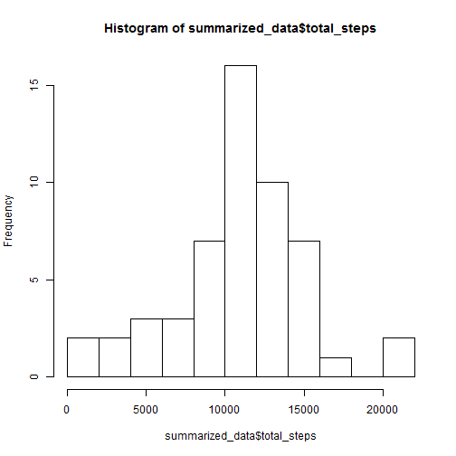
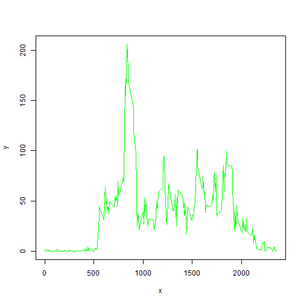
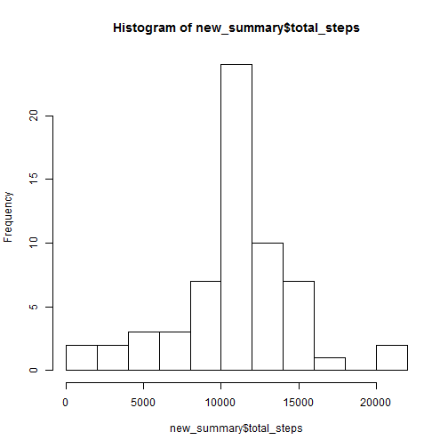
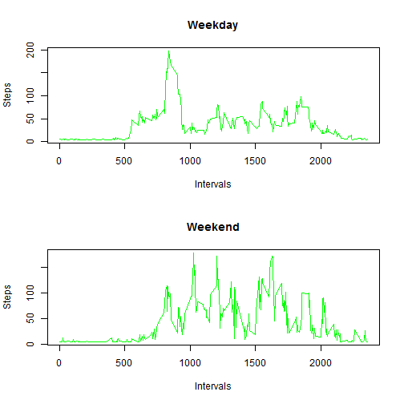

## Loading and preprocessing the data


```r
library(dplyr)
unzip("activity.zip")
new_data <- read.csv("activity.csv",stringsAsFactors = FALSE)
clean_data <- new_data[complete.cases(new_data),]
daily_step <- group_by(clean_data,date)
summarized_data <- summarize(daily_step,total_steps = sum(steps))
```


## What is mean total number of steps taken per day?


```r
mean(summarized_data$total_steps)
```

```
## [1] 10766.19
```

Here is a histogram of the total number of steps taken each day:


```r
hist(summarized_data$total_steps,breaks = 10)
```

 

Here is the median of the total number of steps taken per day:


```r
median(summarized_data$total_steps)
```

```
## [1] 10765
```


## What is the average daily activity pattern?


```r
intervals <- group_by(clean_data,interval)
activity_pattern_data <- summarize(intervals,mean_steps = mean(steps))
x<- activity_pattern_data$interval
y <- activity_pattern_data$mean_steps
plot(x,y,type = "l",col = "GREEN")
```

 

5-minute interval,containing the maximum number of steps:  


```r
max_interval <- max(activity_pattern_data$mean_steps)

activity_pattern_data[activity_pattern_data$mean_steps ==max_interval,1]
```

```
## Source: local data frame [1 x 1]
## 
##   interval
##      (int)
## 1      835
```


## Imputing missing values

The number of missing values:  


```r
count(new_data) - count(clean_data)
```

```
##      n
## 1 2304
```

Filling in all of the missing values in the dataset:  


```r
mean_interval <- mean(activity_pattern_data$mean_steps)
missing <- is.na(new_data$steps)
```


New dataset with the missing data filled in:  


```r
new_data$steps[missing] <- mean_interval
head(new_data)
```

```
##     steps       date interval
## 1 37.3826 2012-10-01        0
## 2 37.3826 2012-10-01        5
## 3 37.3826 2012-10-01       10
## 4 37.3826 2012-10-01       15
## 5 37.3826 2012-10-01       20
## 6 37.3826 2012-10-01       25
```

New summarization for the new filled up missing values:  


```r
new_group <- group_by(new_data,date)
new_summary <- summarize(new_group,total_steps = sum(steps))
```

```r
mean(new_summary$total_steps)
```

```
## [1] 10766.19
```

Here is a histogram of the total number of steps taken each day:  


```r
hist(new_summary$total_steps,breaks = 10)
```

 

Here is the median of the total number of steps taken per day:  


```r
median(new_summary$total_steps)
```

```
## [1] 10766.19
```


The mean and median are almost same as the previous case. It happened  
because the missing values were filled in with the mean steps per five minutes.  


## Are there differences in activity patterns between weekdays and weekends?

Adding weekday and day type column in the dataset:  


```r
new_data$weekday <- weekdays(as.Date(new_data$date))
new_data$day_type <- ifelse(new_data$weekday == "Sunday" | 
                            new_data$weekday =="Sunday","weekend", "weekday")

new_data$day_type >- as.factor(new_data$day_type);  
```

```
## Warning in Ops.factor(as.factor(new_data$day_type)): '-' not meaningful for
## factors
```


Plotting the dataset by weekdays and weekends:  


```r
group <- group_by(new_data,day_type,interval)
final_summary  <- summarize(group,mean_steps = mean(steps))
x<- final_summary$interval
y <- final_summary$mean_steps
par(mfrow = c(2,1))
plot(subset(x,final_summary$day_type=="weekday"),
     subset(y,final_summary$day_type=="weekday"),
     type = "l",col = "GREEN",main = "Weekday",
     xlab = "Intervals",ylab = "Steps")
plot(subset(x,final_summary$day_type=="weekend"),
     subset(y,final_summary$day_type=="weekend"),
     type = "l",col = "GREEN",main = "Weekend",
     xlab = "Intervals",ylab = "Steps")
```

 

###The above panel plot shows that the number of steps are high during weekends.
